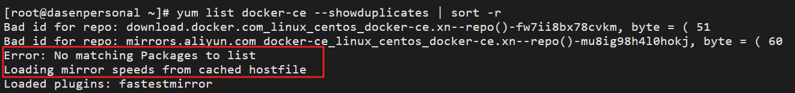
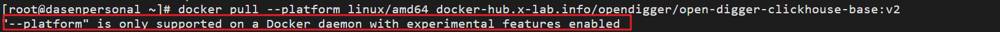

# 服务器准备

用于数据的这台服务器，是在阿里云上另外租的一台，专门用来处理数据。因为 opendigger 提供的数据需要使用 docker 容器拉取，故没有
在自己本机上处理，同时数据量比较大，所以直接租一台服务器来获取数据。


## 0 服务器的信息

1. 服务器使用的操作系统：**Centos7**

2. 服务器配置(cpu/内存)：4核 16GB

3. 服务器硬盘：100GB
> 目前仅够下载全域数据的压缩文件大概 81GB, 后续还需挂在1TB的云盘, 用于存储解压后的数据。

4. 该台服务器目前需要准备的软件包括： docker，git


## 1 docker 准备

该部分内容在互联网上查找得到，对于docker目前不熟悉。

1. `yum -y update` (更新 centos7 yum)
2. `yum install -y yum-utils device-mapper-persistent-data lvm2`
3. `yum list docker-ce --showduplicates | sort -r` (列出来docker版本，选择其中一个安装)
4. `yum -y install docker-ce-18.03.1.ce`
5. `systemctl start docker`, `systemctl enable docker`(启动docker服务，设置开启启动)

这里碰到一个问题，如下：


> 应该是镜像的问题，后面更换了一个镜像就好了。

大概步骤：
1. 配置国内 docker 源:

`sudo yum-config-manager --add-repo https://download.docker.com/linux/centos/docker-ce.repo`

2. 将docker下载地址改为 阿里云

`yum-config-manager --add-repo http://mirrors.aliyun.com/docker-ce/linux/centos/docker-ce.repo`

这样docker就安装成功了，下面拉去 opendigger 提供的镜像。

## 2 opendigger 提供的资源

1. clickhouse server 镜像：`docker pull --platform linux/amd64 docker-hub.x-lab.info/opendigger/open-digger-clickhouse-base:v2`

这里也碰到了问题，如下：


原因是因为没有开启docker的实验性功能：`experimental` ，因为这个功能不能保证api的稳定性，所以默认是关闭的。

可以使用 docker --version 查看。

如果需要开启，则需要在 `daemon.json` 中添加配置，由于这里是新下载的 `docker`，所以直接在 `/etc/docker/`下创建了 `daemon.json`.

然后添加配置信息：
```xml
{
  "registry-mirrors": ["https://zc0n33d2.mirror.aliyuncs.com"],
  "experimental": true"
}
```

之后需要重新加载 daemon，然后重启 docker 服务：

`sudo systemctl daemon-reload`

`sudo systemctl restart docker`


2. 下载 OSS 数据压缩包(全域数据的压缩包，大概 81GB, 可以先存在服务器中，后面还需要挂在一块1T云盘)：

`wget https://oss.x-lab.info/sample_data/2020_full.tar.gz`
